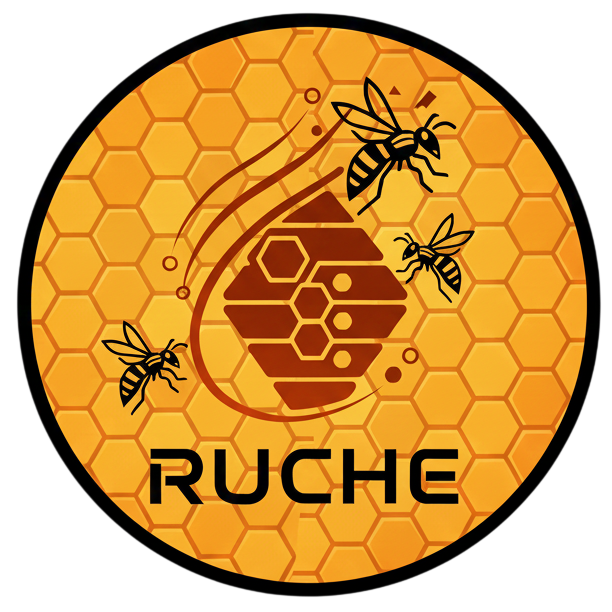

# 🐝 RUCHE
Projet NLP & Text Mining – Master 2 SISE (2025–2026) 

### Application de cherche d'emplois



## Présentation du projet

**RUCHE** est une plateforme d’analyse du marché de l’emploi **Data Science & Intelligence Artificielle** en France.  
Elle combine **web scraping**, **NLP**, **machine learning**, **data warehousing** et **visualisation interactive** pour proposer :

-  **Une recherche sémantique intelligente** d’offres d’emploi  
-  **Une cartographie géographique interactive** du marché de l’emploi  
-  **Des analyses avancées** sur les salaires, les compétences et les tendances du marché
-  **Enregistrement de nouvelles offres** pour les utilisateurs de l'application

Le système repose sur une **architecture end-to-end**, depuis la collecte des données jusqu’à leur exploitation analytique au sein d’une application **Streamlit**.

---

## 🧠 Objectifs du projet

Le projet RUCHE s’inscrit dans le cadre du module **NLP & Text Mining** du Master 2 SISE et répond aux objectifs pédagogiques suivants :

- 📥 **Constituer un corpus d’offres d’emploi**
  - Extraction automatisée d’annonces issues de plateformes d’emploi accessibles en ligne  
    (France Travail, APEC, JobTeaser, Choisir le Service Public, etc.)
  - Collecte réalisée via des techniques de **web scraping** (BeautifulSoup, Selenium) et des **API** lorsque disponibles

- 🧾 **Analyser les annonces dans leurs différentes dimensionnalités**
  - Exploitation des champs structurés lorsqu’ils sont disponibles  
    *(titre, missions, compétences, profil, rémunération, localisation, type de contrat…)*
  - Analyse du **corps textuel complet** lorsque la structure est absente ou hétérogène
  - Focalisation sur les **métiers et compétences liés à la Data Science et à l’Intelligence Artificielle**
  - Stocker sur MongoDB (Base NoSql) dans différentes collections les offres scrapper

- 🗄️ **Mettre en place un entrepôt de données**
  - Créaction d'une pipeline d'ETL pour **extraire** nos offre de MongoDb, les **transformer** et les **charger** dans une BDD relationnel sur MotherDuckdb
  - Modélisation sous forme de **schéma en étoile** (table de faits et dimensions)
  - Stockage dans un **SGBD libre** (DuckDB via MotherDuck)
  - Connexion directe entre l’application et la base de données analytique
    
- 🧠 **Appliquer des méthodes avancées de NLP et de Machine Learning**
  - Filtrage automatique des offres non pertinentes (hors data / IA)
  - Vectorisation sémantique des annonces
  - Recherche par similarité en langage naturel
  - Analyses interprétables et lisibles, y compris lors de l’usage de modèles de langage (LLM)

- 🌐 **Développer une application web interactive**
  - Application Python basée sur **Streamlit**
  - Interface dédiée à l’exploration, la recherche et l’analyse du corpus
  - Visualisations interactives (cartes, graphiques dynamiques, clustering)

- 🗺️ **Intégrer une dimension géographique**
  - Analyse territoriale à l’échelle des villes, départements et régions
  - Représentations cartographiques interactives

- ➕ **Permettre l’ajout dynamique de nouvelles offres**
  - Ajout manuel ou semi-automatisé d’annonces (LLM - Mistral)
  - Mécanismes de **détection de doublons** pour préserver la qualité du corpus

- 🚢 **Garantir la reproductibilité et le déploiement**
  - Déploiement de l’ensemble du système via une **image Docker**
  - L’utilisateur peut lancer l’application sans configuration complexe

---

## 🏗️ Architecture globale

```
┌───────────────┐    ┌────────────────────┐    ┌──────────────────────┐    ┌──────────────────────────┐    ┌──────────────────────┐
│  Web Scraping │ →  │      MongoDB       │ →  │  ETL & Normalisation │ →  │        MotherDuck        │ →  │        Streamlit      │
│ APIs/Crawlers │    │ Data Lake (JSON)   │    │ Nettoyage & Enrich.  │    │ Data Warehouse étoile   │    │ Recherche & Analyses  │
└───────────────┘    └────────────────────┘    └──────────────────────┘    └──────────────────────────┘    └──────────────────────┘
```

---

## 🌐 Sources de données

Quatre plateformes majeures ont été exploitées :

- **France Travail**  
  API officielle, OAuth2, scraping parallèle
- **APEC**  
  Selenium + BeautifulSoup, extraction structurée offline
- **JobTeaser**  
  Anti-bot, scraping React, filtrage précoce
- **Choisir le Service Public**  
  Scraping + extraction structurée assistée par LLM (Mistral)

👉 Les données brutes sont stockées en **MongoDB Atlas** (NoSQL) au format **JSON**.

---

## 🗄️ Data Warehouse – MotherDuck

Le data warehouse repose sur **MotherDuck (DuckDB cloud)** avec :

- **Schéma en étoile**
- **Table de faits** : `f_offre`
- **Dimensions** : `d_date`, `d_contrat`, `d_localisation`, `h_region`

--- 

## Architecture du Projet 

```
RUCHE/
├── data/
│   ├── backup_job_market.duckdb
│   └── local.duckdb
│
├── scraping/
│   ├── francetravail/
│   ├── apec/
│   ├── jobteaser/
│   └── service_public/
│
├── mongodb/
│   ├── main_mongo.py
│   ├── reference_apec.py
│   ├── mongodb_load_jobteaser.py
│   └── mongodb_utils.py
│
├── etl/
│   ├── cleanX.py #Tout les "clean" fpnction de nettoyage de donnée
│   ├── config_etl.py
│   ├── etl_utils.py
│   ├── etl_vectorization.py
│   ├── tfidf_ml_data_filter.py
│   ├── geolocation_enrichment.py # API pour longétude et latitude 
│   └── etl_motherduck.py
│
├── streamlit_app/
│   ├── 1_home_page.py
│   ├── 2_cartographie.py
│   ├── 3_visualisation.py
│   ├── 4_add_offers.py
│   ├── 5_clustering.py
│   ├── 6_graphe_competences.py
│   ├── 7_llm.py
│   ├── 8_about.py
│   ├── app.py
│   ├── config.py
│   ├── static/ # Logo & images
│   ├── db/
│   └── analyse_competences/
│
├── docs/
│   ├── Rapport.md
│   ├── notice_france_travail_scraper.md
│   ├── notice_TFIDF_ML_filtre_data_nondata.md
│   └── notice_moteur_recherche_semantique.md
│
├── duck_to_mother.py
├── pyproject.toml
├── requirements.txt
├── test_connexion_duckdb.py
├── test_creation_duckdb.py
└── README.md

```
--- 

## 🚀 Lancer l’application

1. **Installer les dépendances:**
```bash
pip install -r requirements_mongodo_ftscraper.txt
```

2. **Configurer `.env` file:**
```env
MOTHERDUCK_TOKEN=MOTHERDUCKDB_KEY
MOTHERDUCK_DATABASE = "job_market_RUCHE"
```

3. **Lancer Streamlit**
```bash
streamlit run app.py
```

--- 
## 👥 Équipe

- Romain Buono
-  Yassine Cheniour
- Miléna Gordien-Piquet
- Anne-Camille Vial

#### 🎓 Master 2 SISE – Université Lyon 2####
#### 👨‍🏫 Encadrant : M. Ricco Rakotomalala####

---
